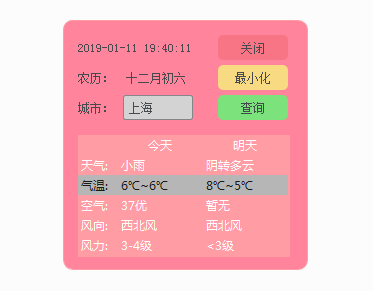

# Pyqt5_Tool

## 安装：
- pip install PyQt5
- pip install PyQt5-tools
或
- pip install PyQt5 -i https://pypi.douban.com/simple
- pip install PyQt5-tools -i https://pypi.douban.com/simple

编译命令：
C:\Python36\Scripts\pyinstaller.exe  -F -w -i  logo.ico Tools.py -n weather
C:\Python36\Scripts\pyinstaller.exe  -F -i  logo.ico Tools.py -n weather

打包参考文档：
https://blog.csdn.net/weixin_42296333/article/details/81178915

打包exe注意 加载的静态资源最好都是绝对位置，python执行和exe执行是两样的，
项目中已经用os.path.split(os.path.realpath(sys.argv[0]))[0]强行绑定

项目中还带了一个sql sever使用demo

数据库操作
连接mysql，可能有连不上的情况
需要把文件C:\Program Files\MySQL\MySQL Server 5.7\lib\libmysql.dll
复制到C:\Python36\Lib\site-packages\PyQt5\Qt\bin目录下

还附带了很多其他5个demo项目
分别是·····

常见报错：
Q:Pyqt5.sip找不到
A:版本不匹配，重新安装pyqt5，pyqt5-tool库

Q:怎么制作icon
A:使用网上工具修改png到icon，不能直接改后缀

Q:图片打包后不生效
A:在res.qrc中添加png文件名，然后使用pyqcc外部工具编译，生成res_rc.py文件就可以了

## 三个外部工具的配置？？？？

## 天气小工具1.0
- QSS优化
- 异常保护少
- 从原来项目脱敏时，保留了post和db操作的demo

### PS:
如果其它电脑无法使用，把这个路径下的3个文件放一起
C:\Python35\Lib\site-packages\PyQt5\plugins\platforms
qminimal.dll
qoffscreen.dll
qwindows.dll

